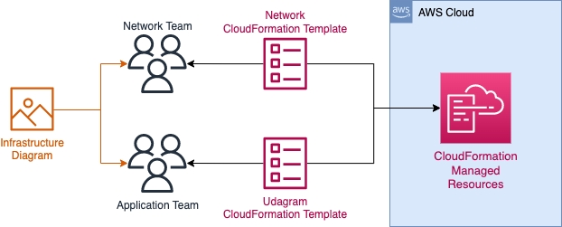
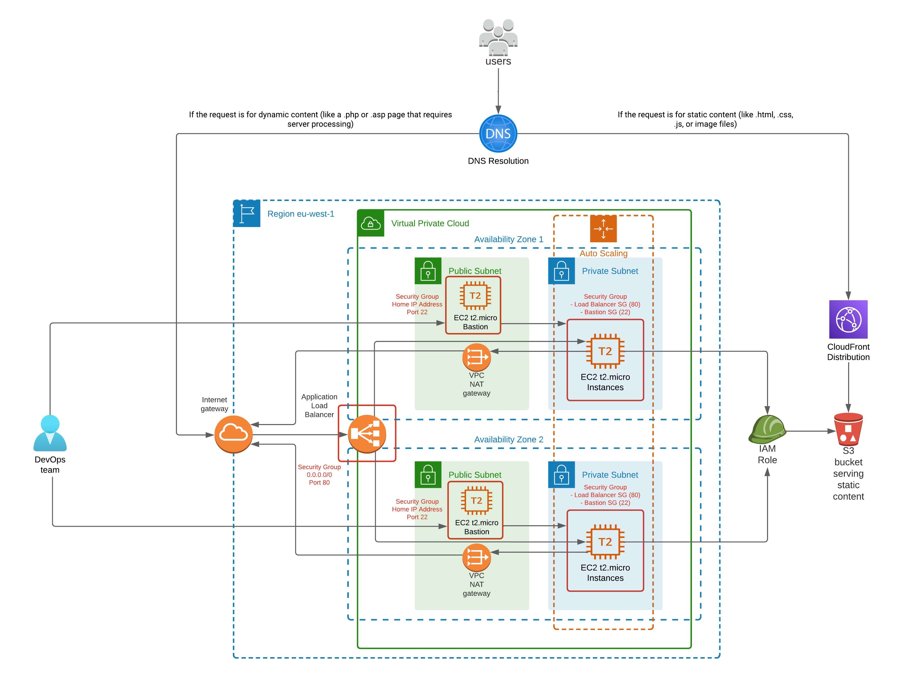
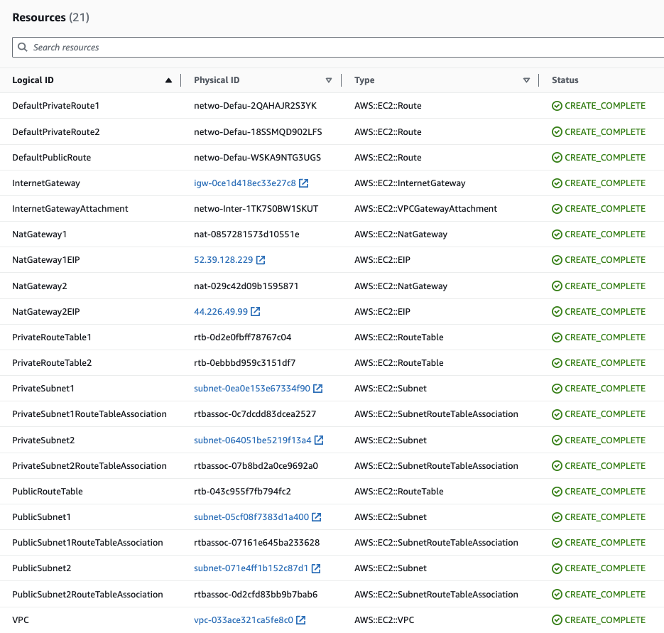
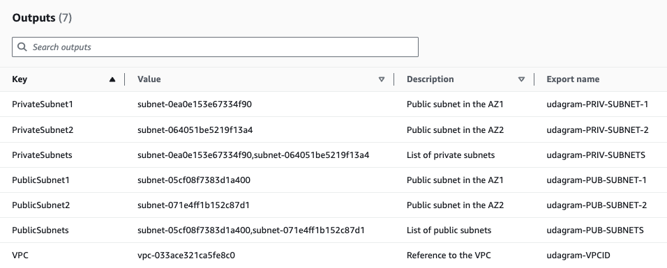
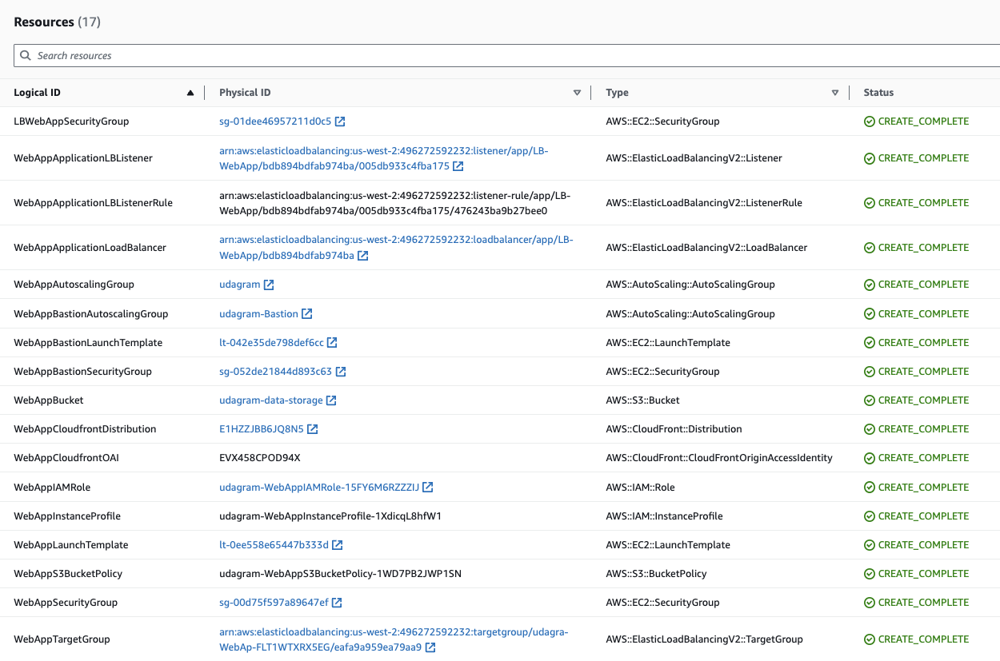
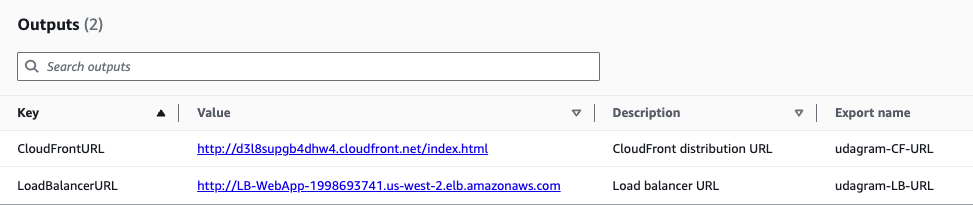
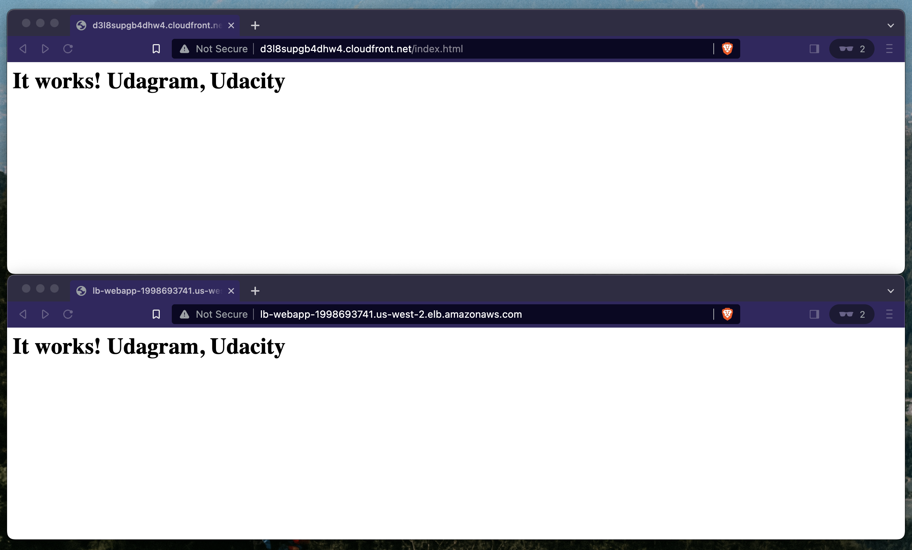

## Project Scenario

Your company is creating an Instagram clone called Udagram, and the requirement is to deploy this new application to the AWS infrastructure using Infrastructure as Code.

You have been tasked with provisioning the required infrastructure and deploying a dummy application, along with the necessary supporting software.

Since the underlying network infrastructure will be maintained by a separate team, you must create independent stacks for the network infrastructure and the application itself.

Infrastructure spin up and tear down needs to be automated so that each team can create and discard testing environments on demand.

## Project Requirements
Each of these categories details the specific requirements for each component of the project. Complete the checklist at the bottom of the page to ensure your project is ready for submission.

## Infrastructure Diagram

1. You'll need to create an infrastructure diagram in a tool of your choice, with all the AWS resources you need for your solution. Resources we expect to see in the diagram:
    a. Network resources: VPC, subnets, Internet Gateway, NAT Gateways
    b. EC2 resources: Autoscaling group with EC2 instances, Load Balancer, Security Groups
    c. Static Content: S3 bucket.
2. Use arrows to include any relevant relations between resources.
3. Feel free to omit name labels for any resource icons you deem appropriate, as long as the diagram is still clear and unambiguous.

## Network and Servers Configuration

1. You can deploy to any region.
2. You'll need to create the networking infrastructure for your solution, including a new VPC and four subnets: two public and two private, following high availability best practices.
3. Use a parameters JSON file to pass CIDR blocks for your VPC and subnets.
4. You'll need to attach Internet and NAT gateways for internet access.
5. You'll need to use Launch Templates to create an Autoscaling Group for your application servers in order to deploy four servers, two located in each of your private subnets.
6. Your CPU and RAM requirements will be covered with t2.micro instances, so use this instance type. The Operating System to be used is Ubuntu 22.
7. The application must be exposed to the internet using an Application Load Balancer.

## Static Content

1. You'll need to create an S3 bucket with CloudFormation to store all static content. This bucket should have public-read access.
2. Your servers IAM Role should provide read and write permissions to this bucket.

## Security Groups

1. Udagram communicates on the default HTTP Port: 80, so your servers will need this inbound port open since you will use it with the Load Balancer and the Load Balancer Health Check. As for outbound, the servers will need unrestricted internet access to be able to download and update their software.
2. The load balancer should allow all public traffic (0.0.0.0/0) on port 80 inbound, which is the default HTTP port.

## CloudFormation Templates

1. Considering that a network team will be in charge of the networking resources, you'll need to deliver two separate templates: one for networking resources and another one for your application specific resources (servers, load balancer, bucket).
2. Your application template should use outputs from your networking template to identify the hosting VPC and subnets.
3. One of the output exports of the CloudFormation application stack should be the public URL of the LoadBalancer. Bonus points if you add http:// in front of the load balancer DNS Name in the output, for convenience.
4. You should be able to create and destroy the entire infrastructure using scripts (no UI interactions). You can use any language you like (bash or python, for example), but you must be using the CloudFormation CLI or libraries built on top of it (boto3, for example).

## BONUS (Optional features)

1. Create a Cloudfront distribution to serve your static content.
2. Set up a bastion host (jump box) to allow you to SSH into your private subnet servers. This bastion host would be on a Public Subnet with port 22 open only to your home IP address, and it would need to have the private key that you use to access the other servers.

# CD12352 - Infrastructure as Code Project Solution
# Cristian Cevasco

## Infrastructure Diagram

## Spin up instructions

1. Create network infrastructure:

`network/create.sh network network.yml network-parameters.json`

2. Create application infrastructure:

`udagram/create.sh udagram udagram.yml udagram-parameters.json`

Important: The Cloudfront distribution can take from 10 to 30 minutes to replicate and during that time
when visiting the URL, you might end up faing a redirection to the s3 bucket, which will result
in an Access Denied output. In that case wait for a couple of minutes and retry.

## Tear down instructions

1. Empty the bucket created.

2. Delete application infrastructure:

`udagram/delete.sh udagram udagram.yml udagram-parameters.json`

3. Delete network infrastructure:

`network/delete.sh network network.yml network-parameters.json`

## Other considerations

In this project, we have simulated serving both static and dynamic content:

- For the static content: A Cloudfront distribution pointing to the S3 bucket

- For the dynamic content: A Load Balancer that will distribute the requests to the EC2 instances
within the private subnets. Note that the actual content served by the EC2 instances is not dynamic. 
The purpose of this project is to demonstrate how to deploy highly available infrastructure. The development of the application itself is beyond this scope.

## Resources and outputs

## Network resources

## Network outputs

## Udagram resources

## Udagram outputs

## Cloudfront distribution and Load Balancer

This screenshot shows the content served by both endpoints:

As a facility for the project reviewers, these are the URLs:

- Cloudfront distribution: http://d3l8supgb4dhw4.cloudfront.net/index.html
- Load Balancer: http://lb-webapp-1998693741.us-west-2.elb.amazonaws.com

Note: the resources will be terminated shortly after receiving the feedback from the mentors.
